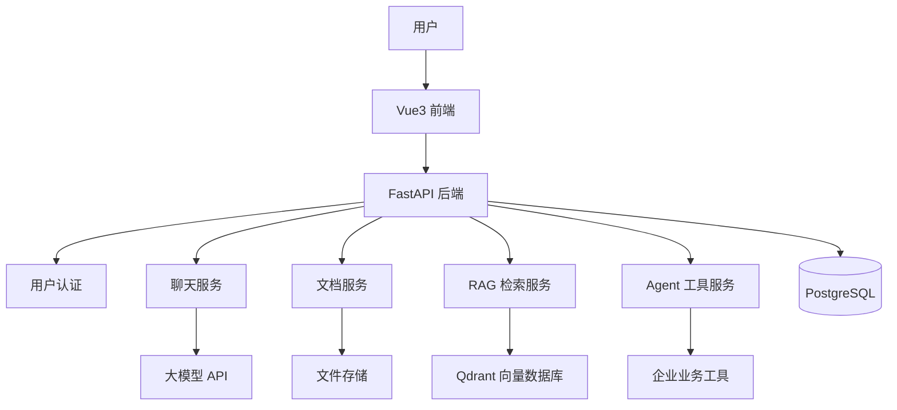
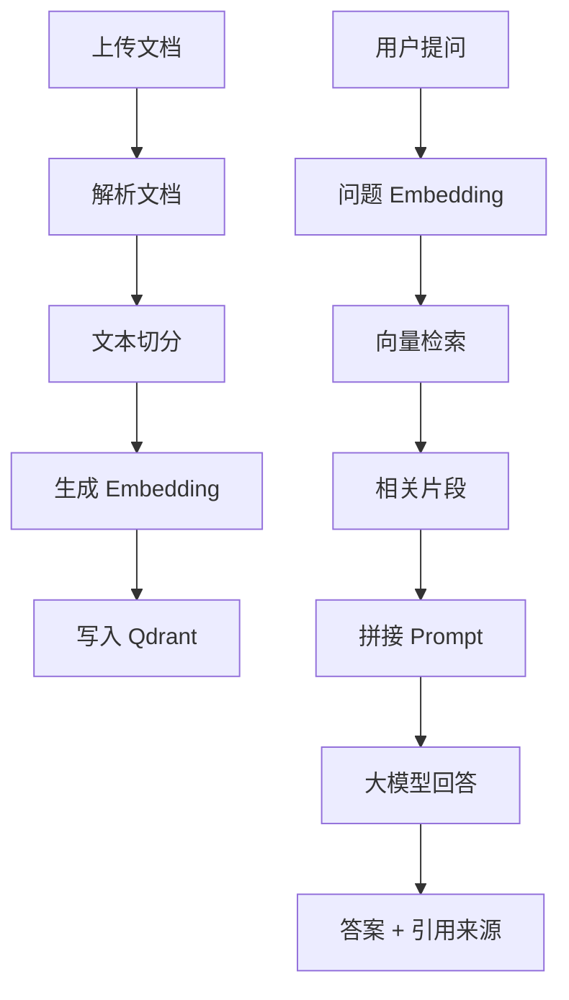
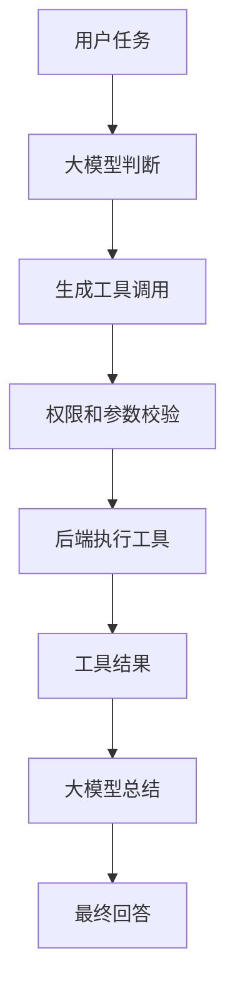
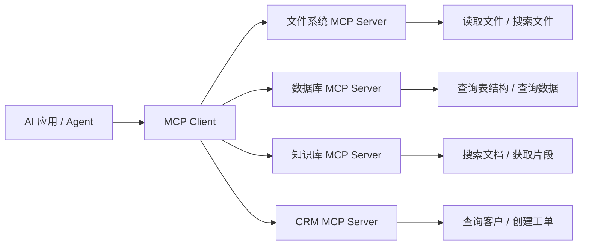
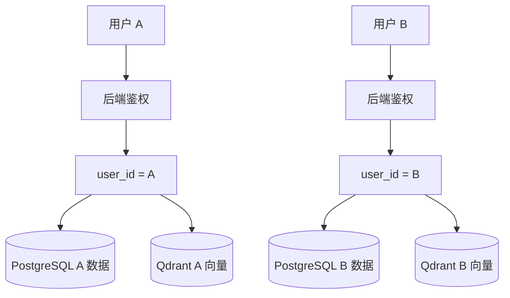
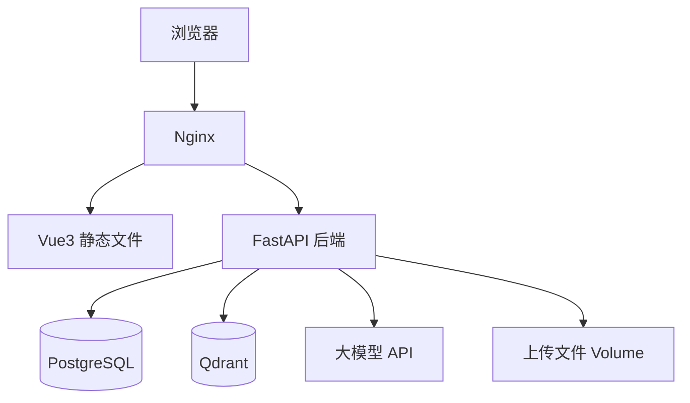

# 架构图

## 企业知识库智能客服架构

```mermaid
flowchart TD
    User[用户] --> Web[Vue3 前端]
    Web --> API[FastAPI 后端]
    API --> Auth[用户认证]
    API --> Chat[聊天服务]
    API --> Doc[文档服务]
    API --> RAG[RAG 检索服务]
    API --> Agent[Agent 工具服务]
    Chat --> LLM[大模型 API]
    RAG --> Vector[Qdrant 向量数据库]
    Doc --> Storage[文件存储]
    API --> DB[(PostgreSQL)]
    Agent --> Tools[企业业务工具]
```

## RAG 流程图

```mermaid
flowchart TD
    Upload[上传文档] --> Parse[解析文档]
    Parse --> Split[文本切分]
    Split --> Embed[生成 Embedding]
    Embed --> Qdrant[写入 Qdrant]
    Question[用户提问] --> QEmbed[问题 Embedding]
    QEmbed --> Search[向量检索]
    Search --> Context[相关片段]
    Context --> Prompt[拼接 Prompt]
    Prompt --> LLM[大模型回答]
    LLM --> Answer[答案 + 引用来源]
```

## Agent 工具调用流程

```mermaid
flowchart TD
    User[用户任务] --> Model[大模型判断]
    Model --> ToolCall[生成工具调用]
    ToolCall --> Check[权限和参数校验]
    Check --> Execute[后端执行工具]
    Execute --> Result[工具结果]
    Result --> Model2[大模型总结]
    Model2 --> Final[最终回答]
```

## MCP 架构图

```mermaid
flowchart LR
    App[AI 应用 / Agent] --> Client[MCP Client]
    Client --> FS[文件系统 MCP Server]
    Client --> DB[数据库 MCP Server]
    Client --> KB[知识库 MCP Server]
    Client --> CRM[CRM MCP Server]
    FS --> FileTools[读取文件 / 搜索文件]
    DB --> DBTools[查询表结构 / 查询数据]
    KB --> KBTools[搜索文档 / 获取片段]
    CRM --> CRMTools[查询客户 / 创建工单]
```

## 权限隔离图

```mermaid
flowchart TD
    UserA[用户 A] --> APIA[后端鉴权]
    UserB[用户 B] --> APIB[后端鉴权]
    APIA --> FilterA[user_id = A]
    APIB --> FilterB[user_id = B]
    FilterA --> DBA[(PostgreSQL A 数据)]
    FilterA --> VecA[(Qdrant A 向量)]
    FilterB --> DBB[(PostgreSQL B 数据)]
    FilterB --> VecB[(Qdrant B 向量)]
```

## Docker 部署图

```mermaid
flowchart TD
    Browser[浏览器] --> Nginx[Nginx]
    Nginx --> Frontend[Vue3 静态文件]
    Nginx --> Backend[FastAPI 后端]
    Backend --> Postgres[(PostgreSQL)]
    Backend --> Qdrant[(Qdrant)]
    Backend --> LLM[大模型 API]
    Backend --> Uploads[上传文件 Volume]
```
